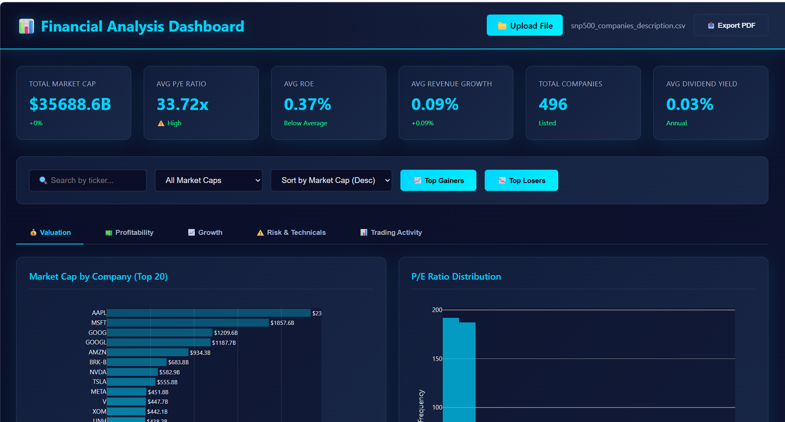

# 📊 AI-Powered Financial Analytics Dashboard

  

An AI Powered financial analytics dashboard that transforms Excel and CSV financial datasets into interactive visualizations and actionable insights in real time.

## ✨ Features

* 📁 Upload Excel (.xlsx) and CSV datasets
* 📊 Interactive financial dashboards
* 📈 Real-time KPI calculations
* 🤖 AI-powered financial analysis
* 💹 Company comparison and stock analysis
* 📉 Risk, profitability, and growth analysis
* 🔍 Search and filter companies
* 📱 Responsive modern UI

## 🛠️ Tech Stack

* HTML5
* CSS3
* JavaScript
* Plotly.js
* SheetJS (XLSX)
* Groq API

## 🚀 Getting Started

1. Clone this repository.
2. Open `index.html` in your browser.
3. Upload your financial dataset.
4. Explore the dashboard and AI insights.

## 📸 Dashboard Preview

 
